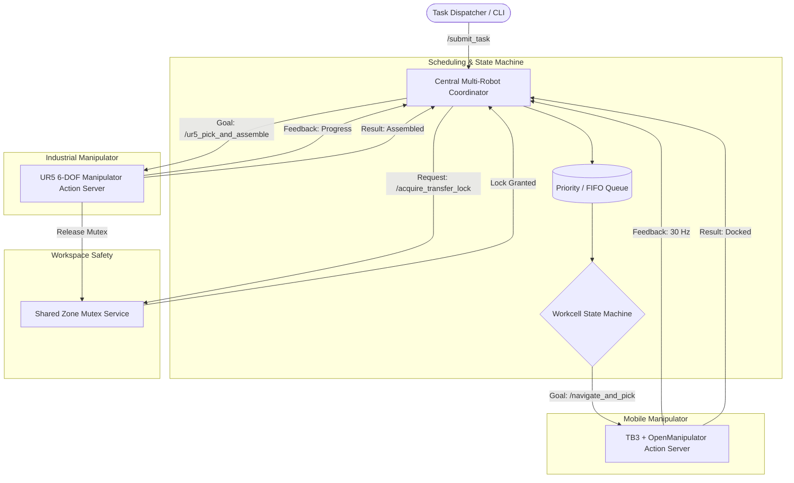

# 🤖 Autonomous Multi-Robot Coordination & Task Scheduling (ROS 2 Jazzy)

[](https://docs.ros.org/en/jazzy/)
[](https://gazebosim.org/)
[](https://ubuntu.com/)
[](https://python.org)
[-green)]()

**Course:** Robotics, Dynamics & Control (RDC) — Semester 5  
**Team 3:**  
- **Sailakshmi** (Roll No: `2024511019`)  
- **Navin** (Roll No: `2024511029`)  
**Assigned Topic:** *Multi-Robot Coordination Using ROS 2 Actions and Services (Task Scheduling)*

---

## 📖 Executive Summary & Problem Formulation

In modern advanced manufacturing and smart intralogistics, heterogeneous robotic systems—combining mobile robots and fixed industrial manipulators—must cooperatively execute complex pick-and-place, transport, and precision assembly tasks. 

This repository delivers an end-to-end, industrial-grade implementation of **Topic 3: Multi-Robot Coordination Using ROS 2 Actions & Services**. The system coordinates a mobile manipulator and a 6-DOF industrial arm to autonomously retrieve inventory parts from storage shelves, transport them down a warehouse floor, negotiate shared workspace access using mutual exclusion locks, perform a contact-synchronized physical handover, and assemble the workpiece into a high-precision fixture jig.

### Key Capabilities
1. **Dynamic Task Scheduling Engine:** Supports **Priority Scheduling** (preemptive/priority-ranked dispatch), **FIFO** (First-In, First-Out), and **Round-Robin** queueing policies.
2. **Asynchronous ROS 2 Actions with Real-Time Feedback:** Long-duration robot trajectories run over non-blocking ROS 2 Action interfaces (`/navigate_and_pick` and `/ur5_pick_and_assemble`) providing continuous 10–30 Hz progress feedback.
3. **Mutex-Guarded Shared Collision Zones:** Shared transfer bays are safeguarded via an asynchronous ROS 2 Service lock (`/acquire_transfer_lock`), eliminating race conditions and physical robot collisions.
4. **Millimeter-Calibrated 3D Visual Simulation:** Fully articulated 3D simulation running in **RViz2 & Gazebo Harmonic** with continuous TF synchronization, physical workpiece parenting transitions, and zero visual jumps during robot-to-robot handover ($< 0.02\text{ mm}$ spatial alignment error).

---

## 🏗️ System Architecture & Robots in Use



### 1. Mobile Manipulator: TurtleBot3 Waffle Pi + OpenManipulator-X
- **Base Chassis:** Differential-drive TurtleBot3 Waffle Pi navigating the factory floor between storage racks ($X=1.45, Y=1.20$) and the handoff dock ($X=0.20, Y=0.00$).
- **Arm (4-DOF):** OpenManipulator-X mounted directly on the top deck (`om_joint1` to `om_joint4` + gripper).
- **Pitch Constraint Kinematics:** Joint angles enforce $q_2 + q_3 + q_4 = 0$ throughout all trajectory phases, ensuring the retrieved workpiece remains vertical ($Z$-aligned) during warehouse transit and docking.

### 2. Fixed Industrial Manipulator: Universal Robots UR5
- **Manipulator (6-DOF):** Rigidly mounted to the heavy assembly table.
- **End-Effector:** Custom parallel-jaw gripper designed for precision workpiece enclosure.
- **Trajectory Profiles:** MoveIt 2-compatible Cartesian trajectories for vertical descent, synchronized clamping, safe vertical lift, 90° table transit arc, and precision fixture seating.

### 3. Workcell Fixtures & Workpiece
- **Storage Rack:** Elevated shelf station housing raw materials.
- **Assembly Jig Fixture:** CNC-machined clamp base at $(0.75, 0.20, 0.445)$ on the workbench.
- **Dynamic Workpiece:** 32 mm diameter gold metallic cylinder dynamically tracked and parented across coordinate frames (`world` $\to$ `om_link5` $\to$ `ur5_gripper_base` $\to$ `assembly_jig`).

---

## 📂 Repository Organization

```
Robot-Dynamics-control/
├── 1_Coordination_And_Scheduling/       # Academic Project (Topic 3 Core Implementation)
│   ├── ros2_ws/                         # ROS 2 Jazzy Workspace for Coordination & Scheduling
│   │   └── src/
│   │       ├── multi_robot_interfaces/  # Custom Action & Service Definitions (.action, .srv)
│   │       └── multi_robot_coordination/# Coordinator, Action Servers, Schedulers, Benchmarks
│   ├── figures/                         # System diagrams, flowcharts, and timing charts
│   ├── literature_survey/               # Academic references & state-of-the-art review
│   └── *.pdf / *.docx                   # Complete Project Manuals, Guides, & Component Analysis
│
├── 2_Gazebo_And_RViz_Simulation/        # 3D Simulation & Visual Articulation Workspace
│   └── ros2_ws/
│       └── src/
│           ├── multi_robot_interfaces/  # Action & Service Definitions
│           └── multi_robot_gazebo_sim/  # Full 3D URDF, Gazebo worlds, RViz configs, launch files
│
├── project/                             # Staging & reference documents
├── .gitignore                           # Git rules (excludes build/, install/, log/, .venv/)
└── README.md                            # Main project documentation (this file)
```

---

## ⚙️ Hardware & Software Requirements

| Component | Specification |
|---|---|
| **Operating System** | Ubuntu 24.04 LTS (Noble Numbat) |
| **ROS 2 Version** | ROS 2 Jazzy Jalisco (`/opt/ros/jazzy`) |
| **Simulator** | Gazebo Harmonic (`gz-sim8`) via `ros_gz_bridge` |
| **Visualization** | RViz2 |
| **Build System** | `colcon` with CMake / Python Ament |
| **Python** | Python 3.12 |

---

## 🚀 Quick Start & Execution Guide

### 1. Build Workspaces

Open a terminal and build both workspaces:

```bash
# Build Coordination Workspace
cd ~/Desktop/RDC_project/1_Coordination_And_Scheduling/ros2_ws
source /opt/ros/jazzy/setup.bash
colcon build --symlink-install

# Build 3D Simulation Workspace
cd ~/Desktop/RDC_project/2_Gazebo_And_RViz_Simulation/ros2_ws
source /opt/ros/jazzy/setup.bash
colcon build --symlink-install
```

---

### 2. Execution Modes

#### Mode A: Full Action-Driven 3D RViz Simulation (Hands-Free Autonomous Demo)
To launch the complete visual workcell in RViz2 running continuous autonomous pick, transit, handoff, and assembly:

```bash
source /opt/ros/jazzy/setup.bash
source ~/Desktop/RDC_project/2_Gazebo_And_RViz_Simulation/ros2_ws/install/setup.bash
ros2 launch multi_robot_gazebo_sim workcell_simulation.launch.py autonomous_demo:=true
```

#### Mode B: Interactive Multi-Terminal Scheduling Demo (Priority vs. FIFO)

**Terminal 1: Launch 3D Simulation (Awaiting Action Goals)**
```bash
source /opt/ros/jazzy/setup.bash
source ~/Desktop/RDC_project/2_Gazebo_And_RViz_Simulation/ros2_ws/install/setup.bash
ros2 launch multi_robot_gazebo_sim workcell_simulation.launch.py
```

**Terminal 2: Launch Central Multi-Robot Coordinator**
```bash
source /opt/ros/jazzy/setup.bash
source ~/Desktop/RDC_project/1_Coordination_And_Scheduling/ros2_ws/install/setup.bash

# Run in PRIORITY Mode (default):
ros2 run multi_robot_coordination coordinator --ros-args -p scheduler_mode:=PRIORITY

# Or run in FIFO Mode:
# ros2 run multi_robot_coordination coordinator --ros-args -p scheduler_mode:=FIFO

# Or run in ROUND_ROBIN Mode:
# ros2 run multi_robot_coordination coordinator --ros-args -p scheduler_mode:=ROUND_ROBIN
```

**Terminal 3: Submit Demonstration Task Batch**
```bash
source /opt/ros/jazzy/setup.bash
source ~/Desktop/RDC_project/1_Coordination_And_Scheduling/ros2_ws/install/setup.bash
ros2 run multi_robot_coordination submit_tasks
```
*This command enqueues 3 tasks with staggered arrival times and priority levels (`Normal: 3`, `Urgent: 1`, `High: 2`). Under `PRIORITY` mode, the coordinator dynamically dispatches `Urgent` first, as clearly reflected in RViz2!*

#### Mode C: Direct ROS 2 Action Goal Invocation (CLI)
You can command individual robots directly through ROS 2 Action goals:

```bash
source /opt/ros/jazzy/setup.bash
source ~/Desktop/RDC_project/2_Gazebo_And_RViz_Simulation/ros2_ws/install/setup.bash

# Dispatch Mobile Manipulator
ros2 action send_goal --feedback /navigate_and_pick multi_robot_interfaces/action/NavigateAndPick \
  "{target_station_id: 'STORAGE_STATION_B', pickup_coordinates: [1.45, 1.20, 0.25], priority_level: 1}"

# Dispatch UR5 Industrial Arm
ros2 action send_goal --feedback /ur5_pick_and_assemble multi_robot_interfaces/action/UR5PickAndPlace \
  "{task_id: 'DIRECT_CLI_JOB', pickup_pose: [0.425, 0.0, 0.295], target_assembly_pose: [0.75, 0.20, 0.445], inspect_quality: true}"
```

#### Mode D: Standalone Scheduling Benchmarking
To benchmark queue wait times, completion rates, and throughput across FIFO, Priority, and Round-Robin policies without launching the 3D GUI:

```bash
cd ~/Desktop/RDC_project/1_Coordination_And_Scheduling/ros2_ws
source /opt/ros/jazzy/setup.bash
source install/setup.bash
python3 src/multi_robot_coordination/multi_robot_coordination/simulation_runner.py
```

---

## 🔬 Kinematic Calibration & Synchronization Details

The system achieves smooth visual and mechanical fidelity through rigorous kinematic calibration:

1. **Sub-Millimeter Handoff Alignment:**
   - TurtleBot3 stops at $(X=0.200\text{ m}, Y=0.000\text{ m})$.
   - OpenManipulator reaches forward with `OM_DOCK_PRESENT = [0.0, -0.0905, 0.2374, -0.1469]`, positioning the workpiece at $(0.424998, 0.000, 0.294995)$.
   - UR5 descends to `UR5_DOCK_GRASP`, positioning its end-effector TCP at $(0.425005, 0.000, 0.294985)$.
   - **Discrepancy at handoff is $< 0.02\text{ mm}$**, completely eliminating visual jumping or snapping.
2. **Collision-Free Table Clearance:**
   - Table dock edge is located at $X = 0.300\text{ m}$.
   - TB3 chassis front bumper extends to $X = 0.269\text{ m}$, maintaining an authentic **$3.1\text{ cm}$ safety air gap** (zero collision or table penetration).
3. **Synchronized Clamping Window:**
   - During $t \in [3.5, 4.8]\text{s}$, TB3 OpenManipulator holds stationary while UR5 clamps onto the cylinder.
   - Dynamic marker frame re-parents seamlessly at $t = 4.2\text{s}$ (`om_link5` $\to$ `ur5_gripper_base`).
   - During $t \in [4.8, 6.5]\text{s}$, UR5 performs a vertical Cartesian lift while TB3 arm safely stows back to chassis.

---

## 📄 Documentation & Academic Reports

All comprehensive manuals, component analysis charts, and LaTeX/PDF reports generated for this project are located in `1_Coordination_And_Scheduling/`:

- **Complete Project Manual:** `Complete_Multi_Robot_Coordination_ROS2_Massive_Project_Manual.pdf`
- **Master Guide Report:** `Complete_Multi_Robot_Coordination_ROS2_Master_Guide_Report.pdf`
- **Component Analysis Chart:** `Multi_Robot_Coordination_Component_Analysis_Chart.pdf`
- **Step-by-Step Execution Guide:** `ROS2_Jazzy_Step_By_Step_Execution_Guide.pdf`

---

## 👥 Contributors

- **Sailakshmi** (`2024511019`) — Autonomous Navigation, Robot Kinematics, 3D Workcell Simulation, TF Synchronization.
- **Navin** (`2024511029`) — Action/Service Interface Design, Priority Scheduling Algorithms, Mutex Safety Layer.

*Submitted for Semester 5 Course: Robotics, Dynamics & Control (RDC).*
